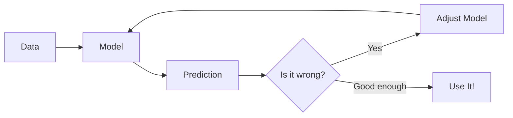

# Module 1: What is Machine Learning? Why TensorFlow.js?  
## A Complete Beginner's Guide (JavaScript Developers Only)

> **Target Audience**: You know **JavaScript** (variables, functions, arrays, `async/await`, DOM, npm).  
> You’ve **never** heard of machine learning, neural networks, or TensorFlow.  
> This module is **100% beginner-friendly**, with **zero math**, **lots of analogies**, and **real JS code**.

---

## Module Overview

| Section | Time | Goal |
|-------|------|------|
| 1.1 What is Machine Learning? | 15 min | Understand ML like a JS function that learns |
| 1.2 Types of Machine Learning | 10 min | See the big picture without confusion |
| 1.3 Why TensorFlow.js? | 10 min | Why this tool is perfect for JS devs |
| 1.4 Your First "Fake ML" Code | 20 min | Write a prediction function in pure JS |
| 1.5 How Real ML Works (High-Level) | 15 min | Peek under the hood — no math |
| 1.6 Setup: Tools & Environment | 15 min | Get ready to code in browser & Node.js |
| 1.7 Quiz & Reflection | 10 min | Test your understanding |
| **Total** | **~95 minutes** | You’ll finish knowing **what** ML is and **why** we use TensorFlow.js |

---

## 1.1 What is Machine Learning? (Think Like a JavaScript Developer)

### Imagine This:
You have a **magic function** that can **predict** things.

```js
function predictHousePrice(squareFeet) {
  return squareFeet * 120 + 5000; // "Magic" formula
}

console.log(predictHousePrice(1000)); // → ~125,000
```

This function **predicts** house prices based on size.  
But **you wrote the rule** (`*120 + 5000`). That’s **not** machine learning.

---

### Machine Learning = "Let the computer write the rule"

```js
// Instead of YOU writing the formula...
// The computer LEARNS it from examples!
```

**Example**:  
You give the computer **100 real houses**:

| Size (sqft) | Price ($) |
|------------|----------|
| 800        | 95,000   |
| 1200       | 145,000  |
| 1500       | 180,000  |

The **ML model** looks at this data and **learns** a pattern:  
> “Price ≈ Size × 120 + 5,000”  
*(It figures this out **automatically**!)*

---

### ML = Teaching a Computer with Examples

| Traditional Programming | Machine Learning |
|------------------------|------------------|
| You write the rules     | You give examples |
| Input → Rules → Output  | Input + Examples → Model → Output |
| Always same result      | Learns & improves |

**Analogy**:  
- **Traditional**: You write a calculator app.  
- **ML**: You show the app 1,000 math problems, and it learns to solve new ones.

---

## 1.2 Types of Machine Learning (Simple Version)

| Type | What It Does | JS Analogy |
|------|-------------|----------|
| **Supervised Learning** | Learns from **labeled data** (input + correct answer) | You give quiz questions + answers → model learns to answer new questions |
| **Unsupervised Learning** | Finds patterns in **unlabeled data** | You give 1,000 photos → model groups similar ones (no labels needed) |
| **Reinforcement Learning** | Learns by trial & error (rewards) | Game AI: tries moves, gets points, learns to win |

**We’ll focus on Supervised Learning first** — easiest to code and understand.

---

## 1.3 Why TensorFlow.js? (Perfect for JavaScript Devs)

| Feature | Why You’ll Love It |
|-------|------------------|
| **Runs in Browser** | No Python, no servers — just HTML + JS |
| **Runs in Node.js** | Use with Express, APIs, CLI tools |
| **Same Code Everywhere** | Write once, run on web or server |
| **Uses GPU (WebGL)** | Fast training in your browser! |
| **Pre-built Models** | Use face detection, pose estimation — like `npm install` |
| **Open Source & Free** | Backed by Google, huge community |

> **Think of TensorFlow.js as “React for Machine Learning”**  
> You build models like components: stack layers, pass data, get predictions.

---

## 1.4 Your First "Fake ML" Code (Pure JavaScript)

Let’s **simulate** what ML does — **without TensorFlow.js yet**.

### Goal: Predict house price from size (like real ML, but you write the rule)

```jsx
// FakeML.jsx
import React, { useState } from 'react';

// Step 1: "Training Data" (Examples the model would learn from)
const trainingData = [
  { size: 800,  price: 95000 },
  { size: 1000, price: 125000 },
  { size: 1200, price: 145000 },
  { size: 1500, price: 180000 },
  { size: 2000, price: 240000 }
];

// Step 2: "Fake Model" — We write the rule (in real ML, computer learns this)
function fakeMLModel(size) {
  // This is what the REAL model would learn:
  // price ≈ size × 120 + 5000
  return size * 120 + 5000;
}

export default function FakeML() {
  const [size, setSize] = useState('');
  const [result, setResult] = useState(null);

  // Step 3: Predict function
  const handlePredict = () => {
    const sizeValue = parseFloat(size);

    if (isNaN(sizeValue) || sizeValue <= 0) {
      setResult({ error: "⚠️ Please enter a valid size!" });
      return;
    }

    const predictedPrice = fakeMLModel(sizeValue);
    setResult({ 
      price: predictedPrice,
      size: sizeValue 
    });
  };

  // Bonus: Show training data
  console.log("Training Examples:", trainingData);

  return (
    <div style={{ fontFamily: 'Arial', padding: '20px' }}>
      <h1>🏠 House Price Predictor (Fake ML)</h1>
      <p>Enter house size in square feet:</p>
      <input 
        type="number" 
        value={size}
        onChange={(e) => setSize(e.target.value)}
        placeholder="e.g. 1200"
        style={{ padding: '10px', fontSize: '16px', margin: '5px' }}
      />
      <button 
        onClick={handlePredict}
        style={{ padding: '10px', fontSize: '16px', margin: '5px' }}
      >
        Predict Price
      </button>
      {result && (
        <div style={{ marginTop: '20px', fontWeight: 'bold', color: result.error ? 'red' : 'green' }}>
          {result.error ? (
            <div>{result.error}</div>
          ) : (
            <>
              <strong>Predicted Price: ${result.price.toLocaleString()}</strong>
              <br />
              <small>Based on learned pattern: price ≈ size × 120 + 5000</small>
            </>
          )}
        </div>
      )}
    </div>
  );
}
```

### Try It!
1. Save as `FakeML.jsx` in your React project
2. Import and use: `<FakeML />`
3. Enter `1300` → Should predict **~$161,000**

---

### What You Just Did (ML Concepts in Action)

| Part | ML Term | What You Did |
|------|--------|-------------|
| `trainingData` | **Dataset** | Examples the model learns from |
| `fakeMLModel()` | **Model** | The "brain" that makes predictions |
| `predict()` | **Inference** | Using the model on new data |
| `size * 120 + 5000` | **Learned Rule** | In real ML, this is discovered automatically |

---

## 1.5 How Real ML Works (High-Level, No Math)



### The Training Loop (Like a `for` loop)

```js
for (let epoch = 1; epoch <= 100; epoch++) {
  model.trainOneStep(data);     // Learn a little
  const error = model.checkError(); 
  if (error < 0.01) break;      // Good enough!
}
```

**You’ll write this in Module 2 with `model.fit()`**

---

### Architecture: Models Are Like LEGO

```
Input Layer → Hidden Layer → Output Layer
     [ ]  ───▶  [::::]   ───▶  [1]
```

- **Input Layer**: Your data (e.g., house size)
- **Hidden Layer**: The "thinking" part (neurons = tiny functions)
- **Output Layer**: Final answer (e.g., price)

**Think of it like a React component tree**:
```jsx
<HousePriceModel>
  <Input size={1200} />
  <HiddenLayer neurons={10} />
  <Output price={145000} />
</HousePriceModel>
```

---

## 1.6 Setup: Tools & Environment

### Option 1: React Project (Recommended)

Create a new React app and install TensorFlow.js:

```bash
npx create-react-app tfjs-app
cd tfjs-app
npm install @tensorflow/tfjs
```

Then import in your components:
```jsx
import * as tf from '@tensorflow/tfjs';
```

### Option 2: Node.js (For APIs, CLI)

```bash
mkdir tfjs-hello
cd tfjs-hello
npm init -y
npm install @tensorflow/tfjs-node
```

Create `hello.js`:
```js
import * as tf from '@tensorflow/tfjs-node';
console.log("TensorFlow.js ready in Node.js!");
tf.tensor([1,2,3]).print();
```

Run:
```bash
node hello.js
```

---

### Recommended Tools

| Tool | Purpose |
|------|--------|
| **VS Code** | Best editor |
| **Live Server** (VS Code extension) | Auto-reload HTML |
| **Chrome DevTools** | Debug tensors |
| **GitHub** | Save your progress |

---

## 1.7 Quiz & Reflection (Test Yourself)

1. **What is the main difference between traditional programming and ML?**  
   → Traditional: You write rules. ML: Computer learns from examples.

2. **Name one advantage of TensorFlow.js for JS developers.**  
   → Runs in browser, no Python needed.

3. **In the fake ML code, what plays the role of the "model"?**  
   → `fakeMLModel(size)` function.

4. **What will you do in Module 2?**  
   → Use **real** TensorFlow.js to train a model (no fake rules!).

---

## Your Module 1 Checklist

- [ ] Read all sections
- [ ] Run `fake-ml.html` and predict 3 house sizes
- [ ] Explain to a friend: “ML is like teaching a JS function with examples”
- [ ] Install Node.js and run `hello.js`
- [ ] Star the repo: [tensorflow/tfjs-examples](https://github.com/tensorflow/tfjs-examples)

---

## Next Steps → Module 2

> **You’ll train your first REAL model**  
> Predict `y = 2x - 1` using `model.fit()`  
> See the computer **learn the rule** from data!

---

## Resources & Further Reading

| Type | Link |
|------|------|
| Official Intro | [tensorflow.org/js](https://www.tensorflow.org/js) |
| Video (10 min) | [YouTube: "What is TensorFlow.js?"](https://www.youtube.com/watch?v=5bZ6i3k7f4w) |
| Interactive Demo | [ml-playground.com](https://ml-playground.com) |
| Book (Free Chapter) | [Learning TensorFlow.js - Chapter 1](https://www.oreilly.com/library/view/learning-tensorflowjs/9781492099966/) |

---
