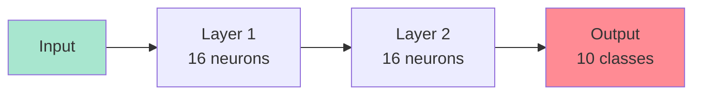

# Module 5: Neural Networks – The Core Architecture  
## From Layers to Full Brain (Zero Math, All Code & Visuals)

> **Target Audience**: You completed **Modules 1–4** — you know ML, tensors, built a classifier, and trained on real data.  
> **No derivatives. No weights.** Just **architecture**, **code**, and **intuition**.

---

## Module Overview

| Section | Time | Goal |
|-------|------|------|
| 5.1 What is a Neural Network? | 10 min | Big picture |
| 5.2 Layers = Building Blocks | 15 min | `dense`, `relu`, `softmax` |
| 5.3 Forward Pass (Data Flow) | 15 min | Input → Output |
| 5.4 Training = Feedback Loop | 15 min | `fit()` under the hood |
| 5.5 Build MNIST Digit Classifier | 30 min | Full 3-layer net |
| 5.6 Add Dropout (Prevent Overfitting) | 20 min | Like noise in training |
| 5.7 Visualize the Network | 20 min | See neurons light up |
| 5.8 TensorBoard.js (Live Training) | 20 min | Pro-level monitoring |
| 5.9 Node.js + Save/Load | 15 min | Export your brain |
| 5.10 Mini Project: Emoji Predictor | 25 min | Text → Emoji |
| 5.11 Quiz & Debug | 15 min | Master NN flow |
| **Total** | **~3.5 hours** | You’ll **build and visualize** a real neural net! |

---

## 5.1 What is a Neural Network? (Think: Brain Made of JS Functions)



### Analogy: **A Team of Tiny Decision Makers**

| Neuron | Job |
|-------|-----|
| Input | Receives raw data (e.g., pixel values) |
| Hidden | Combines inputs → makes guesses |
| Output | Final vote (e.g., “This is a 7”) |

> **No math**: Each neuron is just:  
> `output = activation(input1 * w1 + input2 * w2 + ...)`  
> → `fit()` **learns the `w` values automatically**

---

## 5.2 Layers = LEGO Bricks

| Layer Type | Code | Purpose |
|----------|------|--------|
| `dense` | `tf.layers.dense({units: 16, activation: 'relu'})` | Fully connected |
| `relu` | `activation: 'relu'` | `max(0, x)` → turns off negative |
| `softmax` | `activation: 'softmax'` | Turns scores → probabilities |
| `dropout` | `tf.layers.dropout({rate: 0.2})` | Randomly ignore 20% neurons |

---

## 5.3 Full Working MNIST Classifier

```jsx
// MNISTClassifier.jsx
import React, { useState, useRef, useEffect } from 'react';
import * as tf from '@tensorflow/tfjs';
import * as tfvis from '@tensorflow/tfjs-vis';

export default function MNISTClassifier() {
  const [model, setModel] = useState(null);
  const [trainData, setTrainData] = useState(null);
  const [testData, setTestData] = useState(null);
  const [status, setStatus] = useState('Ready');
  const [prediction, setPrediction] = useState('');
  const [drawing, setDrawing] = useState(false);
  const canvasRef = useRef(null);
  const lossVisRef = useRef(null);
  const modelVisRef = useRef(null);
  const modelRef = useRef(null); // Use ref for immediate access
  const trainDataRef = useRef(null);
  const testDataRef = useRef(null);

  // Load MNIST (simplified: 1000 train, 200 test)
  const loadMNIST = async () => {
    const [trainCsv, testCsv] = await Promise.all([
      fetch('https://storage.googleapis.com/learnjs-data/mnist-demo/mnist_train_1000.csv').then(r => r.text()),
      fetch('https://storage.googleapis.com/learnjs-data/mnist-demo/mnist_test_200.csv').then(r => r.text())
    ]);

    const parse = (csv) => {
      const lines = csv.split('\n').slice(1);
      const labels = [];
      const images = [];
      lines.forEach(line => {
        const vals = line.split(',').map(Number);
        labels.push(vals[0]);
        images.push(vals.slice(1));
      });
      return { images: tf.tensor2d(images), labels: tf.oneHot(tf.tensor1d(labels, 'int32'), 10) };
    };

    const train = parse(trainCsv);
    const test = parse(testCsv);

    // Normalize
    const norm = (img) => img.div(255);
    train.images = norm(train.images);
    test.images = norm(test.images);

    // Cleanup old data
    if (trainDataRef.current) {
      trainDataRef.current.images.dispose();
      trainDataRef.current.labels.dispose();
    }
    if (testDataRef.current) {
      testDataRef.current.images.dispose();
      testDataRef.current.labels.dispose();
    }

    trainDataRef.current = train;
    testDataRef.current = test;
    setTrainData(train);
    setTestData(test);
  };

  // Build 3-layer model
  const createModel = () => {
    // Cleanup old model
    if (modelRef.current) {
      modelRef.current.dispose();
    }
    
    const newModel = tf.sequential();
    newModel.add(tf.layers.dense({
      units: 128,
      activation: 'relu',
      inputShape: [784]
    }));
    newModel.add(tf.layers.dropout({ rate: 0.2 }));
    newModel.add(tf.layers.dense({
      units: 128,
      activation: 'relu'
    }));
    newModel.add(tf.layers.dense({
      units: 10,
      activation: 'softmax'
    }));

    newModel.compile({
      optimizer: 'adam',
      loss: 'categoricalCrossentropy',
      metrics: ['accuracy']
    });

    newModel.summary();
    modelRef.current = newModel; // Store in ref immediately
    setModel(newModel);
    return newModel;
  };

  // Train
  const loadAndTrain = async () => {
    try {
      setStatus('Loading data...');
      await loadMNIST();

      // Get or create model
      let currentModel = modelRef.current;
      if (!currentModel) {
        currentModel = createModel();
      }

      const currentTrainData = trainDataRef.current;
      const currentTestData = testDataRef.current;
      
      if (!currentTrainData || !currentTestData) {
        setStatus('Error: Data not loaded');
        return;
      }

      setStatus('Training...');
      
      const surface = { name: 'Training Loss & Accuracy', tab: 'Training' };
      await currentModel.fit(currentTrainData.images, currentTrainData.labels, {
        epochs: 20,
        batchSize: 32,
        validationData: [currentTestData.images, currentTestData.labels],
        callbacks: tfvis.show.fitCallbacks(surface, ['loss', 'val_loss', 'acc', 'val_acc'])
      });

      setStatus('Training Complete! Try prediction.');
      visualizeModel();
    } catch (error) {
      setStatus(`Error: ${error.message}`);
    }
  };

  // Predict random test digit
  const predictRandom = async () => {
    const currentModel = modelRef.current;
    const currentTestData = testDataRef.current;
    
    if (!currentModel || !currentTestData) {
      alert("Train first!");
      return;
    }

    const idx = Math.floor(Math.random() * 200);
    const img = currentTestData.images.slice([idx, 0], [1, 784]);
    const labelTensor = currentTestData.labels.slice([idx, 0], [1, 10]);
    const label = labelTensor.argMax(-1).dataSync()[0];

    drawImage(img.reshape([28, 28]));
    
    tf.tidy(() => {
      const pred = currentModel.predict(img).dataSync();
      const predicted = pred.indexOf(Math.max(...pred));

      setPrediction(
        `True: ${label} | Predicted: ${predicted}\n` +
        `Confidence: ${(pred[predicted] * 100).toFixed(1)}%`
      );
    });

    // Cleanup
    img.dispose();
    labelTensor.dispose();
  };

  // Draw image from tensor
  const drawImage = (tensor) => {
    if (!canvasRef.current) return;
    const ctx = canvasRef.current.getContext('2d');
    ctx.clearRect(0, 0, 280, 280);
    ctx.save();
    ctx.scale(10, 10);

    const data = tensor.dataSync();
    const img = ctx.createImageData(28, 28);
    for (let i = 0; i < data.length; i++) {
      const val = Math.floor(data[i] * 255);
      const idx = i * 4;
      img.data[idx] = val;
      img.data[idx+1] = val;
      img.data[idx+2] = val;
      img.data[idx+3] = 255;
    }
    ctx.putImageData(img, 0, 0);
    ctx.restore();
  };

  // Visualize model structure
  const visualizeModel = () => {
    if (!model) return;
    const surface = { name: 'Model Summary', tab: 'Model' };
    tfvis.show.modelSummary(surface, model);
  };

  // Canvas drawing handlers
  const getEventPos = (e) => {
    if (!canvasRef.current) return { x: 0, y: 0 };
    const rect = canvasRef.current.getBoundingClientRect();
    return {
      x: (e.clientX || (e.touches && e.touches[0].clientX) || 0) - rect.left,
      y: (e.clientY || (e.touches && e.touches[0].clientY) || 0) - rect.top
    };
  };

  const handleDraw = (e) => {
    if (!drawing || !canvasRef.current) return;
    const { x, y } = getEventPos(e);
    const ctx = canvasRef.current.getContext('2d');
    ctx.fillStyle = 'black';
    ctx.fillRect(x - 15, y - 15, 30, 30);
  };

  const clearCanvas = () => {
    if (!canvasRef.current) return;
    const ctx = canvasRef.current.getContext('2d');
    ctx.clearRect(0, 0, 280, 280);
    setPrediction('');
  };

  // Predict user drawing
  const predictDrawing = async () => {
    const currentModel = modelRef.current;
    if (!currentModel || !canvasRef.current) {
      alert("Train model first!");
      return;
    }

    const smallCanvas = document.createElement('canvas');
    smallCanvas.width = 28;
    smallCanvas.height = 28;
    const sctx = smallCanvas.getContext('2d');
    sctx.drawImage(canvasRef.current, 0, 0, 28, 28);
    const imgData = sctx.getImageData(0, 0, 28, 28).data;

    const input = [];
    for (let i = 0; i < imgData.length; i += 4) {
      input.push(1 - imgData[i] / 255); // invert + normalize
    }

    tf.tidy(() => {
      const tensor = tf.tensor2d([input]);
      const pred = currentModel.predict(tensor).dataSync();
      const digit = pred.indexOf(Math.max(...pred));

      setPrediction(
        `I think you drew: ${digit}\n` +
        `Confidence: ${(pred[digit] * 100).toFixed(1)}%`
      );
    });
  };

  // Canvas event handlers
  useEffect(() => {
    const canvas = canvasRef.current;
    if (!canvas) return;

    const handleMouseDown = () => setDrawing(true);
    const handleMouseUp = () => setDrawing(false);
    const handleMouseMove = (e) => handleDraw(e);
    const handleTouchStart = (e) => {
      e.preventDefault();
      setDrawing(true);
      handleDraw(e);
    };
    const handleTouchEnd = () => setDrawing(false);
    const handleTouchMove = (e) => {
      e.preventDefault();
      handleDraw(e);
    };

    canvas.addEventListener('mousedown', handleMouseDown);
    canvas.addEventListener('mouseup', handleMouseUp);
    canvas.addEventListener('mousemove', handleMouseMove);
    canvas.addEventListener('touchstart', handleTouchStart);
    canvas.addEventListener('touchend', handleTouchEnd);
    canvas.addEventListener('touchmove', handleTouchMove);

    return () => {
      canvas.removeEventListener('mousedown', handleMouseDown);
      canvas.removeEventListener('mouseup', handleMouseUp);
      canvas.removeEventListener('mousemove', handleMouseMove);
      canvas.removeEventListener('touchstart', handleTouchStart);
      canvas.removeEventListener('touchend', handleTouchEnd);
      canvas.removeEventListener('touchmove', handleTouchMove);
    };
  }, [drawing]);

  useEffect(() => {
    return () => {
      if (modelRef.current) {
        modelRef.current.dispose();
        modelRef.current = null;
      }
      if (trainDataRef.current) {
        trainDataRef.current.images.dispose();
        trainDataRef.current.labels.dispose();
        trainDataRef.current = null;
      }
      if (testDataRef.current) {
        testDataRef.current.images.dispose();
        testDataRef.current.labels.dispose();
        testDataRef.current = null;
      }
    };
  }, []);

  const cardStyle = {
    border: '1px solid #ddd',
    padding: '15px',
    borderRadius: '8px'
  };

  return (
    <div style={{ fontFamily: 'Arial', padding: '20px', maxWidth: '1000px', margin: 'auto' }}>
      <h1>Handwritten Digit Classifier (0–9)</h1>
      <p>Train a 3-layer neural network on <strong>MNIST</strong> dataset.</p>

      <div style={{ display: 'grid', gridTemplateColumns: '1fr 1fr', gap: '20px' }}>
        <div style={cardStyle}>
          <h3>Training Controls</h3>
          <button 
            onClick={loadAndTrain}
            style={{ padding: '10px 15px', fontSize: '16px', margin: '5px' }}
          >
            Load Data & Train (20 epochs)
          </button>
          <button 
            onClick={predictRandom}
            style={{ padding: '10px 15px', fontSize: '16px', margin: '5px' }}
          >
            Predict Random Test Digit
          </button>
          <div>{status}</div>
          <div ref={lossVisRef} style={{ height: '300px' }} />
        </div>

        <div style={cardStyle}>
          <h3>Live Prediction</h3>
          <canvas 
            ref={canvasRef}
            width={280}
            height={280}
            style={{ imageRendering: 'pixelated', border: '1px solid #ccc' }}
          />
          <button 
            onClick={clearCanvas}
            style={{ padding: '10px 15px', fontSize: '16px', margin: '5px' }}
          >
            Clear
          </button>
          <div style={{ whiteSpace: 'pre-line' }}>{prediction}</div>
        </div>
      </div>

      <div style={{ ...cardStyle, marginTop: '20px' }}>
        <h3>Draw Your Own Digit!</h3>
        <button 
          onClick={predictDrawing}
          style={{ padding: '10px 15px', fontSize: '16px', margin: '5px' }}
        >
          Predict My Drawing
        </button>
      </div>

      <div style={{ ...cardStyle, marginTop: '20px' }}>
        <h3>Network Visualization</h3>
        <div ref={modelVisRef} style={{ height: '300px' }} />
      </div>
    </div>
  );
}
```

### Save as `MNISTClassifier.jsx` in your React project

**Install dependencies:**
```bash
npm install @tensorflow/tfjs @tensorflow/tfjs-vis
```

---

## 5.4 Key Concepts (No Math!)

| Concept | What It Is | JS Analogy |
|-------|-----------|----------|
| **Forward Pass** | Data flows → output | Function call |
| **Backpropagation** | Error flows ← adjusts weights | `fit()` magic |
| **Dropout** | Randomly ignore neurons | `Math.random() < 0.2 ? skip : use` |
| **Overfitting** | Memorizes training data | Hardcoding answers |
| **Softmax** | `[2.1, 0.3, 7.8]` → `[0.1, 0.0, 0.9]` | Normalize scores |

---

## 5.5 TensorBoard.js – Live Training Dashboard

Add this **before training**:

```js
const tbCallback = tf.callbacks.tensorBoard('/tmp/tfjs-logs');
await model.fit(..., { callbacks: [tbCallback] });
```

Then run in terminal:
```bash
tensorboard --logdir /tmp/tfjs-logs
```

> See loss, accuracy, histograms — **pro ML engineer tool**!

---

## 5.6 Save & Load in Node.js

```js
// save-model.js
import * as tf from '@tensorflow/tfjs-node';
import fs from 'fs';

const model = tf.sequential({ layers: [
  tf.layers.dense({ units: 128, activation: 'relu', inputShape: [784] }),
  tf.layers.dense({ units: 10, activation: 'softmax' })
]});

await model.save('file://./mnist-model');
console.log('Model saved!');
```

Load later:
```js
const loaded = await tf.loadLayersModel('file://./mnist-model/model.json');
```

---

## 5.7 Mini Project: **Emoji Predictor from Text**

| Text | Emoji |
|------|-------|
| "I love pizza" | pizza |
| "Happy birthday!" | birthday_cake |
| "So tired" | sleepy |

**Steps**:
1. Create CSV
2. One-hot encode words
3. Train small NN
4. Input → emoji

---

## 5.8 Debug Checklist

| Issue | Fix |
|------|-----|
| `Input shape mismatch` | `[784]` not `[28,28]` |
| Low accuracy | Add dropout, more epochs |
| `model is null` | Train before predict |
| Canvas not drawing | Check `scale(10,10)` |

---

## 5.9 Quiz

1. What does `relu` do?  
   → `max(0, x)` — removes negatives.

2. Why use `dropout`?  
   → Prevent overfitting.

3. What is the **output layer** for 10 digits?  
   → `dense({units: 10, activation: 'softmax'})`

4. How to visualize training?  
   → `tfvis.show.fitCallbacks()`

---

## Your Module 5 Checklist

- [ ] Train MNIST → >95% accuracy
- [ ] Predict 5 random digits
- [ ] **Draw your own digit** → model predicts
- [ ] Save model in Node.js
- [ ] Build **Emoji Predictor**
- [ ] Explain: “Neural nets stack layers to learn patterns”

---

## Resources

| Type | Link |
|------|------|
| MNIST Data | [learnjs-data/mnist-demo](https://storage.googleapis.com/learnjs-data/mnist-demo/) |
| TF.js Vis | [tfjs-vis.github.io](https://github.com/tensorflow/tfjs-vis) |
| Video | [YouTube: Neural Nets in 15 min](https://www.youtube.com/watch?v=aircAruvnKk) |

---
