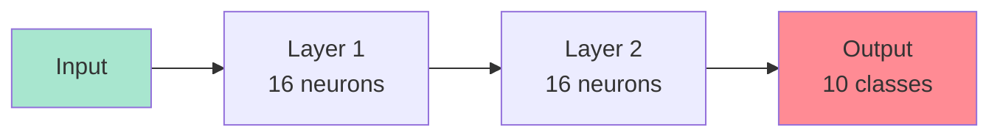

# Module 5: Neural Networks – The Core Architecture  
## From Layers to Full Brain (Zero Math, All Code & Visuals)

> **Target Audience**: You completed **Modules 1–4** — you know ML, tensors, built a classifier, and trained on real data.  
> **No derivatives. No weights.** Just **architecture**, **code**, and **intuition**.

---

## Module Overview

| Section | Time | Goal |
|-------|------|------|
| 5.1 What is a Neural Network? | 10 min | Big picture |
| 5.2 Layers = Building Blocks | 15 min | `dense`, `relu`, `softmax` |
| 5.3 Forward Pass (Data Flow) | 15 min | Input → Output |
| 5.4 Training = Feedback Loop | 15 min | `fit()` under the hood |
| 5.5 Build MNIST Digit Classifier | 30 min | Full 3-layer net |
| 5.6 Add Dropout (Prevent Overfitting) | 20 min | Like noise in training |
| 5.7 Visualize the Network | 20 min | See neurons light up |
| 5.8 TensorBoard.js (Live Training) | 20 min | Pro-level monitoring |
| 5.9 Node.js + Save/Load | 15 min | Export your brain |
| 5.10 Mini Project: Emoji Predictor | 25 min | Text → Emoji |
| 5.11 Quiz & Debug | 15 min | Master NN flow |
| **Total** | **~3.5 hours** | You’ll **build and visualize** a real neural net! |

---

## 5.1 What is a Neural Network? (Think: Brain Made of JS Functions)



### Analogy: **A Team of Tiny Decision Makers**

| Neuron | Job |
|-------|-----|
| Input | Receives raw data (e.g., pixel values) |
| Hidden | Combines inputs → makes guesses |
| Output | Final vote (e.g., “This is a 7”) |

> **No math**: Each neuron is just:  
> `output = activation(input1 * w1 + input2 * w2 + ...)`  
> → `fit()` **learns the `w` values automatically**

---

## 5.2 Layers = LEGO Bricks

| Layer Type | Code | Purpose |
|----------|------|--------|
| `dense` | `tf.layers.dense({units: 16, activation: 'relu'})` | Fully connected |
| `relu` | `activation: 'relu'` | `max(0, x)` → turns off negative |
| `softmax` | `activation: 'softmax'` | Turns scores → probabilities |
| `dropout` | `tf.layers.dropout({rate: 0.2})` | Randomly ignore 20% neurons |

---

## 5.3 Full Working MNIST Classifier

```html
<!DOCTYPE html>
<html>
<head>
  <title>Module 5: MNIST Digit Classifier</title>
  <script src="https://cdn.jsdelivr.net/npm/@tensorflow/tfjs@latest/dist/tf.min.js"></script>
  <script src="https://cdn.jsdelivr.net/npm/@tensorflow/tfjs-vis@latest"></script>
  <script src="https://cdn.jsdelivr.net/npm/chart.js"></script>
  <style>
    body { font-family: Arial; padding: 20px; max-width: 1000px; margin: auto; }
    .container { display: grid; grid-template-columns: 1fr 1fr; gap: 20px; }
    .card { border: 1px solid #ddd; padding: 15px; border-radius: 8px; }
    canvas { image-rendering: pixelated; border: 1px solid #ccc; }
    button { padding: 10px 15px; font-size: 16px; margin: 5px; }
    .vis-container { height: 300px; }
    .code { background: #f8f8f8; padding: 12px; border-radius: 6px; font-family: monospace; font-size: 13px; }
  </style>
</head>
<body>

  <h1>Handwritten Digit Classifier (0–9)</h1>
  <p>Train a 3-layer neural network on <strong>MNIST</strong> dataset.</p>

  <div class="container">
    <div class="card">
      <h3>Training Controls</h3>
      <button onclick="loadAndTrain()">Load Data & Train (20 epochs)</button>
      <button onclick="predictRandom()">Predict Random Test Digit</button>
      <div id="status">Ready</div>
      <div class="vis-container" id="lossVis"></div>
    </div>

    <div class="card">
      <h3>Live Prediction</h3>
      <canvas id="digitCanvas" width="280" height="280"></canvas>
      <button onclick="clearCanvas()">Clear</button>
      <div id="prediction"></div>
    </div>
  </div>

  <div class="card" style="margin-top: 20px;">
    <h3>Network Visualization</h3>
    <div class="vis-container" id="modelVis"></div>
  </div>

  <script>
    let model, trainData, testData;

    // Load MNIST (simplified: 1000 train, 200 test)
    async function loadMNIST() {
      const [trainCsv, testCsv] = await Promise.all([
        fetch('https://storage.googleapis.com/learnjs-data/mnist-demo/mnist_train_1000.csv').then(r => r.text()),
        fetch('https://storage.googleapis.com/learnjs-data/mnist-demo/mnist_test_200.csv').then(r => r.text())
      ]);

      const parse = (csv) => {
        const lines = csv.split('\n').slice(1);
        const labels = [];
        const images = [];
        lines.forEach(line => {
          const vals = line.split(',').map(Number);
          labels.push(vals[0]);
          images.push(vals.slice(1));
        });
        return { images: tf.tensor2d(images), labels: tf.oneHot(tf.tensor1d(labels, 'int32'), 10) };
      };

      trainData = parse(trainCsv);
      testData = parse(testCsv);

      // Normalize
      const norm = (img) => img.div(255);
      trainData.images = norm(trainData.images);
      testData.images = norm(testData.images);
    }

    // Build 3-layer model
    function createModel() {
      model = tf.sequential();
      model.add(tf.layers.dense({
        units: 128,
        activation: 'relu',
        inputShape: [784]
      }));
      model.add(tf.layers.dropout({ rate: 0.2 }));
      model.add(tf.layers.dense({
        units: 128,
        activation: 'relu'
      }));
      model.add(tf.layers.dense({
        units: 10,
        activation: 'softmax'
      }));

      model.compile({
        optimizer: 'adam',
        loss: 'categoricalCrossentropy',
        metrics: ['accuracy']
      });

      model.summary();
    }

    // Train
    async function loadAndTrain() {
      document.getElementById('status').innerHTML = 'Loading data...';
      await loadMNIST();

      createModel();
      document.getElementById('status').innerHTML = 'Training...';

      const surface = { name: 'Training Loss & Accuracy', tab: 'Training' };
      await model.fit(trainData.images, trainData.labels, {
        epochs: 20,
        batchSize: 32,
        validationData: [testData.images, testData.labels],
        callbacks: tfvis.show.fitCallbacks(surface, ['loss', 'val_loss', 'acc', 'val_acc'])
      });

      document.getElementById('status').innerHTML = 
        '<span style="color:green">Training Complete! Try prediction.</span>';

      visualizeModel();
    }

    // Predict random test digit
    async function predictRandom() {
      if (!model || !testData) return alert("Train first!");

      const idx = Math.floor(Math.random() * 200);
      const img = testData.images.slice([idx, 0], [1, 784]);
      const label = testData.labels.slice([idx, 0], [1, 10]).argMax(-1).dataSync()[0];

      drawImage(img.reshape([28, 28]));
      const pred = model.predict(img).dataSync();
      const predicted = pred.indexOf(Math.max(...pred));

      document.getElementById('prediction').innerHTML = `
        <strong>True: ${label} | Predicted: ${predicted}</strong><br>
        Confidence: ${(pred[predicted] * 100).toFixed(1)}%
      `;
    }

    // Draw image from tensor
    function drawImage(tensor) {
      const canvas = document.getElementById('digitCanvas');
      const ctx = canvas.getContext('2d');
      ctx.clearRect(0, 0, 280, 280);
      ctx.scale(10, 10);

      const data = tensor.dataSync();
      const img = ctx.createImageData(28, 28);
      for (let i = 0; i < data.length; i++) {
        const val = Math.floor(data[i] * 255);
        const idx = i * 4;
        img.data[idx] = val;
        img.data[idx+1] = val;
        img.data[idx+2] = val;
        img.data[idx+3] = 255;
      }
      ctx.putImageData(img, 0, 0);
    }

    // Visualize model structure
    function visualizeModel() {
      const surface = { name: 'Model Summary', tab: 'Model' };
      tfvis.show.modelSummary(surface, model);
    }

    // Canvas drawing for user input
    const canvas = document.getElementById('digitCanvas');
    const ctx = canvas.getContext('2d');
    let drawing = false;

    canvas.addEventListener('mousedown', () => drawing = true);
    canvas.addEventListener('mouseup', () => drawing = false);
    canvas.addEventListener('mousemove', draw);
    canvas.addEventListener('touchstart', (e) => { drawing = true; draw(e.touches[0]); });
    canvas.addEventListener('touchend', () => drawing = false);
    canvas.addEventListener('touchmove', (e) => { e.preventDefault(); draw(e.touches[0]); });

    function draw(e) {
      if (!drawing) return;
      const rect = canvas.getBoundingClientRect();
      const x = (e.clientX || e.pageX) - rect.left;
      const y = (e.clientY || e.pageY) - rect.top;
      ctx.fillStyle = 'black';
      ctx.fillRect(x - 15, y - 15, 30, 30);
    }

    function clearCanvas() {
      ctx.clearRect(0, 0, 280, 280);
      document.getElementById('prediction').innerHTML = '';
    }

    // Bonus: Predict user drawing
    window.predictDrawing = async function() {
      if (!model) return alert("Train model first!");

      const smallCanvas = document.createElement('canvas');
      smallCanvas.width = 28;
      smallCanvas.height = 28;
      const sctx = smallCanvas.getContext('2d');
      sctx.drawImage(canvas, 0, 0, 28, 28);
      const imgData = sctx.getImageData(0, 0, 28, 28).data;

      const input = [];
      for (let i = 0; i < imgData.length; i += 4) {
        input.push(1 - imgData[i] / 255); // invert + normalize
      }

      const tensor = tf.tensor2d([input]);
      const pred = model.predict(tensor).dataSync();
      const digit = pred.indexOf(Math.max(...pred));

      document.getElementById('prediction').innerHTML = `
        <strong>I think you drew: ${digit}</strong><br>
        Confidence: ${(pred[digit] * 100).toFixed(1)}%
      `;
    };
  </script>

  <div class="card" style="margin-top: 20px;">
    <h3>Draw Your Own Digit!</h3>
    <button onclick="predictDrawing()">Predict My Drawing</button>
  </div>

</body>
</html>
```

### Save as `module5-mnist-classifier.html` → Open in Chrome

---

## 5.4 Key Concepts (No Math!)

| Concept | What It Is | JS Analogy |
|-------|-----------|----------|
| **Forward Pass** | Data flows → output | Function call |
| **Backpropagation** | Error flows ← adjusts weights | `fit()` magic |
| **Dropout** | Randomly ignore neurons | `Math.random() < 0.2 ? skip : use` |
| **Overfitting** | Memorizes training data | Hardcoding answers |
| **Softmax** | `[2.1, 0.3, 7.8]` → `[0.1, 0.0, 0.9]` | Normalize scores |

---

## 5.5 TensorBoard.js – Live Training Dashboard

Add this **before training**:

```js
const tbCallback = tf.callbacks.tensorBoard('/tmp/tfjs-logs');
await model.fit(..., { callbacks: [tbCallback] });
```

Then run in terminal:
```bash
tensorboard --logdir /tmp/tfjs-logs
```

> See loss, accuracy, histograms — **pro ML engineer tool**!

---

## 5.6 Save & Load in Node.js

```js
// save-model.js
import * as tf from '@tensorflow/tfjs-node';
import fs from 'fs';

const model = tf.sequential({ layers: [
  tf.layers.dense({ units: 128, activation: 'relu', inputShape: [784] }),
  tf.layers.dense({ units: 10, activation: 'softmax' })
]});

await model.save('file://./mnist-model');
console.log('Model saved!');
```

Load later:
```js
const loaded = await tf.loadLayersModel('file://./mnist-model/model.json');
```

---

## 5.7 Mini Project: **Emoji Predictor from Text**

| Text | Emoji |
|------|-------|
| "I love pizza" | pizza |
| "Happy birthday!" | birthday_cake |
| "So tired" | sleepy |

**Steps**:
1. Create CSV
2. One-hot encode words
3. Train small NN
4. Input → emoji

---

## 5.8 Debug Checklist

| Issue | Fix |
|------|-----|
| `Input shape mismatch` | `[784]` not `[28,28]` |
| Low accuracy | Add dropout, more epochs |
| `model is null` | Train before predict |
| Canvas not drawing | Check `scale(10,10)` |

---

## 5.9 Quiz

1. What does `relu` do?  
   → `max(0, x)` — removes negatives.

2. Why use `dropout`?  
   → Prevent overfitting.

3. What is the **output layer** for 10 digits?  
   → `dense({units: 10, activation: 'softmax'})`

4. How to visualize training?  
   → `tfvis.show.fitCallbacks()`

---

## Your Module 5 Checklist

- [ ] Train MNIST → >95% accuracy
- [ ] Predict 5 random digits
- [ ] **Draw your own digit** → model predicts
- [ ] Save model in Node.js
- [ ] Build **Emoji Predictor**
- [ ] Explain: “Neural nets stack layers to learn patterns”

---

## Resources

| Type | Link |
|------|------|
| MNIST Data | [learnjs-data/mnist-demo](https://storage.googleapis.com/learnjs-data/mnist-demo/) |
| TF.js Vis | [tfjs-vis.github.io](https://github.com/tensorflow/tfjs-vis) |
| Video | [YouTube: Neural Nets in 15 min](https://www.youtube.com/watch?v=aircAruvnKk) |

---

**You just built a brain!**  
From input pixels to output digits — **all in JavaScript**.

> **Save as `MODULE-5.md`**  
> Next: **Module 6** — Real-world data pipelines!

---
