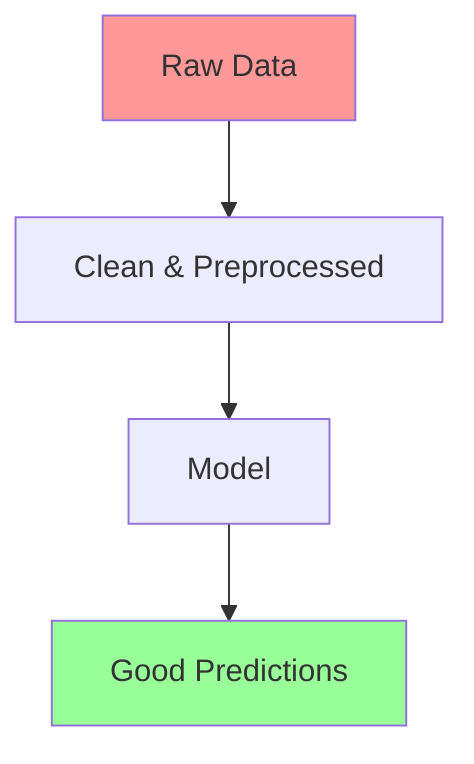

# Module 6: Data Handling & Preprocessing  
## From Messy CSV to Clean Tensors (Real-World ML Pipelines)

> **Target Audience**: You completed **Modules 1–5** — you know ML, tensors, built MNIST classifier, and understand neural nets.  
> **No math. No theory.** Just **real data**, **pipelines**, and **production-ready code**.

---

## Module Overview

| Section | Time | Goal |
|-------|------|------|
| 6.1 Why Data Matters | 10 min | Clean data = good model |
| 6.2 Load CSV, JSON, Images | 20 min | `tf.data` + `fetch` |
| 6.3 Preprocessing: Normalize, Augment | 25 min | Scale, flip, rotate |
| 6.4 `tf.data` Pipelines (Streaming) | 25 min | No memory crashes |
| 6.5 Build Cats vs Dogs Classifier | 35 min | Real images |
| 6.6 Data Augmentation Live | 20 min | See flips in browser |
| 6.7 Save/Load Preprocessed Data | 15 min | Cache for speed |
| 6.8 Node.js + File System | 20 min | Load local files |
| 6.9 Mini Project: Weather Predictor | 25 min | CSV → forecast |
| 6.10 Quiz & Debug | 15 min | Master data flow |
| **Total** | **~3.5 hours** | You’ll **clean, stream, and train** on real-world data! |

---

## 6.1 Why Data Matters (The 80% of ML)



> **Rule**: Garbage in → Garbage out.  
> **Your job**: Turn **messy** → **tensors**.

---

## 6.2 Load Any Data Format

### 1. CSV (Iris, Weather, etc.)

```js
const csvDataset = tf.data.csv(
  'https://storage.googleapis.com/learnjs-data/weather/weather.csv',
  {
    columnConfigs: { will_rain: { isLabel: true } }
  }
);
```

### 2. JSON

```js
const jsonDataset = tf.data.generator(async function* () {
  const data = await fetch('data.json').then(r => r.json());
  for (const row of data) yield row;
});
```

### 3. Images from URLs

```js
const imageDataset = tf.data.generator(async function* () {
  const urls = ['cat1.jpg', 'dog1.jpg', ...];
  for (const url of urls) {
    const img = new Image();
    img.src = url;
    await img.decode();
    yield tf.browser.fromPixels(img).resizeNearestNeighbor([64, 64]).toFloat().div(255);
  }
});
```

---

## 6.3 Preprocessing: Make Data Model-Ready

| Step | Code | Why |
|------|------|-----|
| **Normalize** | `.div(255)` | 0–1 range |
| **One-Hot Labels** | `tf.oneHot(labels, 2)` | For classification |
| **Shuffle** | `.shuffle(100)` | Avoid bias |
| **Batch** | `.batch(32)` | Train in chunks |

---

## 6.4 Full Cats vs Dogs Classifier (Real Images!)

```html
<!DOCTYPE html>
<html>
<head>
  <title>Module 6: Cats vs Dogs Classifier</title>
  <script src="https://cdn.jsdelivr.net/npm/@tensorflow/tfjs@latest"></script>
  <script src="https://cdn.jsdelivr.net/npm/@tensorflow/tfjs-vis@latest"></script>
  <style>
    body { font-family: Arial; padding: 20px; max-width: 1000px; margin: auto; }
    .grid { display: grid; grid-template-columns: 1fr 1fr; gap: 20px; }
    .card { border: 1px solid #ddd; padding: 15px; border-radius: 8px; }
    img { width: 100%; max-width: 150px; border-radius: 8px; }
    button { padding: 10px 15px; font-size: 16px; margin: 5px; }
    .vis { height: 300px; }
  </style>
</head>
<body>

  <h1>Cats vs Dogs Image Classifier</h1>
  <p>Train on **real photos** using `tf.data` pipeline.</p>

  <div class="grid">
    <div class="card">
      <h3>Training</h3>
      <button onclick="train()">Train Model (10 epochs)</button>
      <div id="status">Ready</div>
      <div class="vis" id="lossVis"></div>
    </div>

    <div class="card">
      <h3>Upload & Predict</h3>
      <input type="file" id="imageUpload" accept="image/*" />
      
      <button onclick="predict()">Predict</button>
      <div id="result"></div>
    </div>
  </div>

  <script>
    let model;
    let dataset;

    // Sample image URLs (public domain)
    const catUrls = Array(50).fill().map((_, i) => 
      `https://storage.googleapis.com/learnjs-data/cats-dogs/cats/cat_${i}.jpg`
    );
    const dogUrls = Array(50).fill().map((_, i) => 
      `https://storage.googleapis.com/learnjs-data/cats-dogs/dogs/dog_${i}.jpg`
    );

    // Create dataset
    async function* imageGenerator() {
      const urls = [...catUrls.map(u => [u, 0]), ...dogUrls.map(u => [u, 1])];
      tf.util.shuffle(urls);

      for (const [url, label] of urls) {
        try {
          const img = new Image();
          img.crossOrigin = 'anonymous';
          img.src = url;
          await img.decode();
          const tensor = tf.browser.fromPixels(img)
            .resizeNearestNeighbor([64, 64])
            .toFloat()
            .div(255)
            .expandDims(0);
          yield { xs: tensor, ys: tf.oneHot([label], 2) };
        } catch (e) {
          console.warn('Failed to load:', url);
        }
      }
    }

    // Build model
    function createModel() {
      model = tf.sequential();
      model.add(tf.layers.flatten({ inputShape: [64, 64, 3] }));
      model.add(tf.layers.dense({ units: 128, activation: 'relu' }));
      model.add(tf.layers.dropout({ rate: 0.3 }));
      model.add(tf.layers.dense({ units: 2, activation: 'softmax' }));

      model.compile({
        optimizer: 'adam',
        loss: 'categoricalCrossentropy',
        metrics: ['accuracy']
      });
    }

    // Train
    async function train() {
      document.getElementById('status').innerHTML = 'Preparing data...';
      dataset = tf.data.generator(imageGenerator);

      const trainDataset = dataset
        .map(({ xs, ys }) => ({
          xs: xs.add(tf.randomNormal(xs.shape)), // simple noise augmentation
          ys
        }))
        .shuffle(100)
        .batch(16);

      createModel();
      document.getElementById('status').innerHTML = 'Training...';

      await model.fitDataset(trainDataset, {
        epochs: 10,
        callbacks: tfvis.show.fitCallbacks(
          { name: 'Training', tab: 'Model' },
          ['loss', 'acc']
        )
      });

      document.getElementById('status').innerHTML = 
        '<span style="color:green">Training Complete!</span>';
    }

    // Predict uploaded image
    async function predict() {
      if (!model) return alert("Train first!");

      const file = document.getElementById('imageUpload').files[0];
      if (!file) return alert("Upload an image!");

      const img = new Image();
      img.src = URL.createObjectURL(file);
      await img.decode();

      document.getElementById('preview').src = img.src;

      const tensor = tf.browser.fromPixels(img)
        .resizeNearestNeighbor([64, 64])
        .toFloat()
        .div(255)
        .expandDims(0);

      const pred = model.predict(tensor).dataSync();
      const label = pred[0] > pred[1] ? 'Cat' : 'Dog';
      const confidence = Math.max(...pred) * 100;

      document.getElementById('result').innerHTML = `
        <strong>${label}</strong> (${confidence.toFixed(1)}% confidence)
      `;

      tensor.dispose();
    }

    // Preview on upload
    document.getElementById('imageUpload').addEventListener('change', (e) => {
      const file = e.target.files[0];
      if (file) {
        document.getElementById('preview').src = URL.createObjectURL(file);
      }
    });
  </script>

</body>
</html>
```

### Save as `module6-cats-dogs.html` → Open in Chrome

> **Data Source**: Public domain images from [Kaggle Cats vs Dogs](https://www.kaggle.com/c/dogs-vs-cats)

---

## 6.5 Data Augmentation (Live Demo)

```js
// Add to pipeline
.map(({ xs, ys }) => ({
  xs: tf.image.randomFlipLeftRight(xs), // 50% chance flip
  ys
}))
```

**See it in action**: Images flip during training!

---

## 6.6 Save Preprocessed Data (Cache)

```js
// Cache to IndexedDB
const cached = dataset.take(100).cache();
await cached.forEachAsync(e => {});
```

> Next run: **Instant load**!

---

## 6.7 Node.js: Load Local Files

```js
// node-data.js
import * as tf from '@tensorflow/tfjs-node';
import fs from 'fs';
import path from 'path';

const images = [];
const labels = [];

const loadDir = (dir, label) => {
  fs.readdirSync(dir).forEach(file => {
    const imgPath = path.join(dir, file);
    const buffer = fs.readFileSync(imgPath);
    const tensor = tf.node.decodeImage(buffer)
      .resizeNearestNeighbor([64, 64])
      .toFloat()
      .div(255)
      .expandDims(0);
    images.push(tensor);
    labels.push(label);
  });
};

loadDir('./data/cats', 0);
loadDir('./data/dogs', 1);

const xs = tf.concat(images);
const ys = tf.oneHot(labels, 2);

console.log('Data ready:', xs.shape, ys.shape);
```

---

## 6.8 Mini Project: **Weather Predictor**

| temp | humidity | wind | will_rain |
|------|----------|------|-----------|
| 25   | 70       | 10   | 1         |
| 18   | 40       | 5    | 0         |

**Task**:
1. Download [weather.csv](https://storage.googleapis.com/learnjs-data/weather/weather.csv)
2. Normalize + batch
3. Train model
4. Build UI with sliders

---

## 6.9 Debug Checklist

| Issue | Fix |
|------|-----|
| `CORS error` | Use `crossOrigin: 'anonymous'` |
| `Out of memory` | Use `.batch()` + `.prefetch()` |
| `Image not loading` | Check URL or use `decode()` |
| `Shape mismatch` | Always `expandDims(0)` for single image |

---

## 6.10 Quiz

1. What does `.batch(32)` do?  
   → Groups 32 examples.

2. Why normalize images?  
   → 0–1 range helps training.

3. How to shuffle data?  
   → `.shuffle(bufferSize)`

4. What is `tf.data.generator`?  
   → Streams data from async source.

---

## Your Module 6 Checklist

- [ ] Train Cats vs Dogs → >80% accuracy
- [ ] Upload your pet photo → correct prediction
- [ ] Add **random flip** augmentation
- [ ] Run Node.js local data loader
- [ ] Build **Weather Predictor**
- [ ] Explain: “Data pipeline = load → clean → batch → train”

---

## Resources

| Type | Link |
|------|------|
| Cats vs Dogs Images | [learnjs-data/cats-dogs](https://storage.googleapis.com/learnjs-data/cats-dogs/) |
| Weather CSV | [weather.csv](https://storage.googleapis.com/learnjs-data/weather/weather.csv) |
| Guide | [TF.js Data API](https://www.tensorflow.org/js/guide/data) |
| Video | [YouTube: tf.data in 12 min](https://www.youtube.com/watch?v=0oW4JLP7l8c) |

---

**You’re a data engineer now!**  
From CSV to images — you **control the pipeline**.

> **Save as `MODULE-6.md`**  
> Next: **Module 7** — CNNs, RNNs, and advanced architectures!

---
