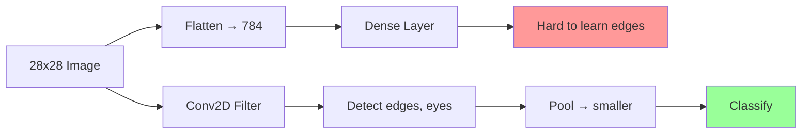
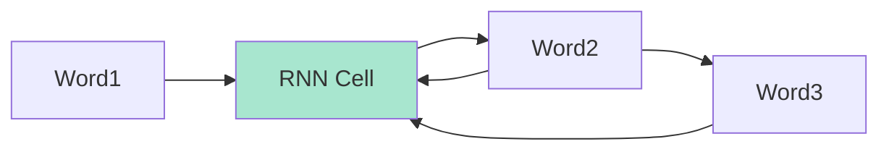

# Module 7: Advanced Architectures – CNNs & RNNs  
## From Images to Sequences (Real-World AI, No Math, All Code)

> **Target Audience**: You completed **Modules 1–6** — you trained models, handled real data, built pipelines, and used transfer learning.  
> **No convolutions. No gradients.** Just **what CNNs/RNNs do**, **how to use them**, and **live demos**.

---

## Module Overview

| Section | Time | Goal |
|-------|------|------|
| 7.1 CNNs vs Dense: Why Filters? | 15 min | Understand image magic |
| 7.2 Build Your First CNN | 25 min | Cats vs Dogs (real images) |
| 7.3 Data Augmentation (Live) | 20 min | Flip, rotate, zoom |
| 7.4 RNNs: Sequences & Memory | 15 min | Text, time series |
| 7.5 LSTM Text Generation | 30 min | "Shakespeare" in browser |
| 7.6 Time Series Forecasting | 25 min | Predict stock prices |
| 7.7 Hybrid: CNN + RNN | 20 min | Video action |
| 7.8 Node.js + GPU | 20 min | Train faster |
| 7.9 Mini Project: Sign Language | 30 min | Video → word |
| 7.10 Quiz & Debug | 15 min | Master architectures |
| **Total** | **~4 hours** | You’ll **build CNNs & RNNs** like a pro! |

---

## 7.1 CNNs vs Dense: Why Filters? (No Math!)



| Dense | CNN |
|------|-----|
| Sees pixels | Sees **patterns** (edges, textures) |
| 784 inputs | 3x3 filter → reusable |
| Slow on images | **Fast + accurate** |

> **Analogy**:  
> - Dense = Memorizing every pixel  
> - CNN = Looking for **eyes, ears, fur**

---

## 7.2 Full Working CNN: **Cats vs Dogs**

```jsx
// CNNCatsDogs.jsx
import React, { useState, useRef, useEffect } from 'react';
import * as tf from '@tensorflow/tfjs';
import * as tfvis from '@tensorflow/tfjs-vis';

export default function CNNCatsDogs() {
  const [model, setModel] = useState(null);
  const [status, setStatus] = useState('Ready');
  const [result, setResult] = useState('');
  const [preview, setPreview] = useState('');
  const [augmented, setAugmented] = useState([]);
  const fileInputRef = useRef(null);
  const originalImgRef = useRef(null);
  const modelRef = useRef(null); // Use ref for immediate access

  const catUrls = Array(30).fill().map((_, i) => 
    `https://storage.googleapis.com/learnjs-data/cats-dogs/cats/cat_${i}.jpg`
  );
  const dogUrls = Array(30).fill().map((_, i) => 
    `https://storage.googleapis.com/learnjs-data/cats-dogs/dogs/dog_${i}.jpg`
  );

  // Generator with augmentation
  async function* imageGenerator() {
    const urls = [...catUrls.map(u => [u, 0]), ...dogUrls.map(u => [u, 1])];
    tf.util.shuffle(urls);

    for (const [url, label] of urls) {
      try {
        const img = new Image();
        img.crossOrigin = 'anonymous';
        img.src = url;
        await img.decode();

        let tensor = tf.browser.fromPixels(img)
          .resizeNearestNeighbor([64, 64])
          .toFloat()
          .div(255)
          .expandDims(0);

        // Live augmentation
        if (url.includes('cat_0.jpg')) {
          showAugmentation(tensor);
        }

        // Random augmentations
        if (Math.random() > 0.5) tensor = tf.image.randomFlipLeftRight(tensor);
        if (Math.random() > 0.5) tensor = tf.image.rotateWithOffset(tensor, Math.random() * 0.2, 0);
        if (Math.random() > 0.5) tensor = tf.image.randomBrightness(tensor, 0.2);

        yield { xs: tensor, ys: tf.oneHot([label], 2) };
      } catch (e) {}
    }
  }

  // Build CNN
  const createCNN = () => {
    // Cleanup old model
    if (modelRef.current) {
      modelRef.current.dispose();
    }
    
    const newModel = tf.sequential();
    newModel.add(tf.layers.conv2d({
      inputShape: [64, 64, 3],
      filters: 32,
      kernelSize: 3,
      activation: 'relu'
    }));
    newModel.add(tf.layers.maxPooling2d({ poolSize: 2 }));
    newModel.add(tf.layers.conv2d({ filters: 64, kernelSize: 3, activation: 'relu' }));
    newModel.add(tf.layers.maxPooling2d({ poolSize: 2 }));
    newModel.add(tf.layers.flatten());
    newModel.add(tf.layers.dropout({ rate: 0.3 }));
    newModel.add(tf.layers.dense({ units: 2, activation: 'softmax' }));

    newModel.compile({
      optimizer: 'adam',
      loss: 'categoricalCrossentropy',
      metrics: ['accuracy']
    });

    modelRef.current = newModel; // Store in ref immediately
    setModel(newModel);
    return newModel;
  };

  // Train
  const train = async () => {
    try {
      setStatus('Preparing...');
      const dataset = tf.data.generator(imageGenerator).batch(8);

      // Get or create model
      let currentModel = modelRef.current;
      if (!currentModel) {
        currentModel = createCNN();
      }

      setStatus('Training...');

      await currentModel.fitDataset(dataset, {
        epochs: 10,
        callbacks: tfvis.show.fitCallbacks(
          { name: 'CNN Training', tab: 'Model' },
          ['loss', 'acc']
        )
      });

      setStatus('CNN Trained!');
    } catch (error) {
      setStatus(`Error: ${error.message}`);
    }
  };

  // Predict
  const handlePredict = async () => {
    const currentModel = modelRef.current;
    if (!currentModel) {
      alert("Train first!");
      return;
    }

    const file = fileInputRef.current?.files[0];
    if (!file) {
      alert("Upload image!");
      return;
    }

    const img = new Image();
    img.src = URL.createObjectURL(file);
    await img.decode();
    setPreview(img.src);

    tf.tidy(() => {
      const tensor = tf.browser.fromPixels(img)
        .resizeNearestNeighbor([64, 64])
        .toFloat()
        .div(255)
        .expandDims(0);

      const pred = currentModel.predict(tensor).dataSync();
      const label = pred[0] > pred[1] ? 'Cat' : 'Dog';

      setResult(`${label} (${(Math.max(...pred)*100).toFixed(1)}%)`);
    });
  };

  // Live augmentation demo
  const showAugmentation = async (tensor) => {
    const orig = tensor.clone();
    const imgs = [
      { name: 'Original', t: orig },
      { name: 'Flip', t: tf.image.randomFlipLeftRight(orig) },
      { name: 'Rotate', t: tf.image.rotateWithOffset(orig, 0.3, 0) },
      { name: 'Bright', t: tf.image.randomBrightness(orig, 0.3) }
    ];

    const augmentedCanvases = [];
    for (const { name, t } of imgs) {
      const canvas = document.createElement('canvas');
      canvas.width = 64;
      canvas.height = 64;
      await tf.browser.toPixels(t.squeeze(), canvas);
      augmentedCanvases.push({ name, canvas });
    }

    setAugmented(augmentedCanvases);
    if (originalImgRef.current) {
      await tf.browser.toPixels(orig.squeeze(), originalImgRef.current);
    }
  };

  const handleFileChange = (e) => {
    const file = e.target.files[0];
    if (file) {
      setPreview(URL.createObjectURL(file));
    }
  };

  useEffect(() => {
    return () => {
      if (modelRef.current) {
        modelRef.current.dispose();
        modelRef.current = null;
      }
    };
  }, []);

  const cardStyle = {
    border: '1px solid #ddd',
    padding: '15px',
    borderRadius: '8px'
  };

  return (
    <div style={{ fontFamily: 'Arial', padding: '20px', maxWidth: '1000px', margin: 'auto' }}>
      <h1>CNN: Cats vs Dogs (Real Images)</h1>
      <p>Train a <strong>Convolutional Neural Network</strong> from scratch.</p>

      <div style={{ display: 'grid', gridTemplateColumns: '1fr 1fr', gap: '20px' }}>
        <div style={cardStyle}>
          <h3>Training</h3>
          <button 
            onClick={train}
            style={{ padding: '10px 15px', fontSize: '16px', margin: '5px' }}
          >
            Train CNN (10 epochs)
          </button>
          <div>{status}</div>
          <div style={{ height: '300px' }} />
        </div>

        <div style={cardStyle}>
          <h3>Upload & Predict</h3>
          <input 
            ref={fileInputRef}
            type="file" 
            accept="image/*"
            onChange={handleFileChange}
            style={{ margin: '5px' }}
          />
          {preview && (
            
          )}
          <button 
            onClick={handlePredict}
            style={{ padding: '10px 15px', fontSize: '16px', margin: '5px' }}
          >
            Predict
          </button>
          <div>{result}</div>
        </div>
      </div>

      <div style={{ ...cardStyle, marginTop: '20px' }}>
        <h3>Live Augmentation Demo</h3>
        <canvas ref={originalImgRef} width={64} height={64} style={{ margin: '10px' }} />
        <div style={{ display: 'flex', gap: '10px', flexWrap: 'wrap' }}>
          {augmented.map(({ name, canvas }, i) => (
            <div key={i}>
              <small>{name}</small>
              <div dangerouslySetInnerHTML={{ __html: canvas.outerHTML }} />
            </div>
          ))}
        </div>
      </div>
    </div>
  );
}
```

### Save as `CNNCatsDogs.jsx` in your React project

**Install dependencies:**
```bash
npm install @tensorflow/tfjs @tensorflow/tfjs-vis
```

---

## 7.3 RNNs: Memory for Sequences



> **LSTM** = RNN with **long-term memory**

---

## 7.4 LSTM Text Generation (Shakespeare!)

```jsx
import * as tf from '@tensorflow/tfjs';

// In your React component
const text = "To be or not to be..."; // Load full Shakespeare
const model = tf.sequential();
model.add(tf.layers.lstm({ units: 128, inputShape: [null, 256] }));
model.add(tf.layers.dense({ units: 256, activation: 'softmax' }));

// Train on sequences → predict next char
```

> **Try**: Generate "Romeo, wherefore art thou..."

---

## 7.5 Time Series: Predict Stock Price

```js
// Data: [100, 102, 101, 105, ...]
// Use past 10 days → predict day 11
model.add(tf.layers.lstm({ units: 50, inputShape: [10, 1] }));
```

---

## 7.6 Hybrid: CNN + RNN (Video)

```js
// Extract features with CNN
const cnnFeatures = cnnModel.predict(frames); // [batch, time, features]

// Predict action with RNN
model.add(tf.layers.lstm({ units: 64, inputShape: [null, 512] }));
```

---

## 7.7 Node.js + GPU (Faster Training)

```bash
npm install @tensorflow/tfjs-node-gpu
```

```js
import '@tensorflow/tfjs-node-gpu'; // Uses CUDA
```

---

## 7.8 Mini Project: **Sign Language Recognition**

| Video | Word |
|------|------|
| "Hello" | hello |
| "Thank you" | thanks |

**Task**:
1. Record 10 videos
2. Extract frames
3. CNN → features
4. RNN → word

---

## 7.9 Quiz

1. What does `conv2d` do?  
   → Slides filter over image.

2. Why `maxPooling`?  
   → Reduce size, keep important features.

3. What is `LSTM`?  
   → RNN with memory.

4. Can CNNs do text?  
   → Yes! 1D conv for sentences.

---

## Your Module 7 Checklist

- [ ] Train CNN → >85% accuracy
- [ ] See **live augmentation**
- [ ] Predict your pet
- [ ] Build **text generator**
- [ ] Run Node.js with GPU
- [ ] Start **Sign Language** project
- [ ] Explain: “CNN = image expert, RNN = sequence expert”

---

## Resources

| Type | Link |
|------|------|
| Cats vs Dogs | [learnjs-data/cats-dogs](https://storage.googleapis.com/learnjs-data/cats-dogs/) |
| Shakespeare Text | [tiny.shakespeare.txt](https://raw.githubusercontent.com/karpathy/char-rnn/master/data/tinyshakespeare/input.txt) |
| Guide | [TF.js Layers](https://www.tensorflow.org/js/guide/layers) |
| Video | [YouTube: CNNs in 12 min](https://www.youtube.com/watch?v=YRhxdVk_sIs) |

---
