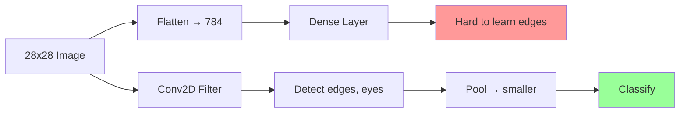
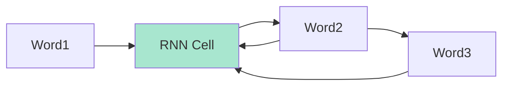

# Module 7: Advanced Architectures – CNNs & RNNs  
## From Images to Sequences (Real-World AI, No Math, All Code)

> **Target Audience**: You completed **Modules 1–6** — you trained models, handled real data, built pipelines, and used transfer learning.  
> **No convolutions. No gradients.** Just **what CNNs/RNNs do**, **how to use them**, and **live demos**.

---

## Module Overview

| Section | Time | Goal |
|-------|------|------|
| 7.1 CNNs vs Dense: Why Filters? | 15 min | Understand image magic |
| 7.2 Build Your First CNN | 25 min | Cats vs Dogs (real images) |
| 7.3 Data Augmentation (Live) | 20 min | Flip, rotate, zoom |
| 7.4 RNNs: Sequences & Memory | 15 min | Text, time series |
| 7.5 LSTM Text Generation | 30 min | "Shakespeare" in browser |
| 7.6 Time Series Forecasting | 25 min | Predict stock prices |
| 7.7 Hybrid: CNN + RNN | 20 min | Video action |
| 7.8 Node.js + GPU | 20 min | Train faster |
| 7.9 Mini Project: Sign Language | 30 min | Video → word |
| 7.10 Quiz & Debug | 15 min | Master architectures |
| **Total** | **~4 hours** | You’ll **build CNNs & RNNs** like a pro! |

---

## 7.1 CNNs vs Dense: Why Filters? (No Math!)



| Dense | CNN |
|------|-----|
| Sees pixels | Sees **patterns** (edges, textures) |
| 784 inputs | 3x3 filter → reusable |
| Slow on images | **Fast + accurate** |

> **Analogy**:  
> - Dense = Memorizing every pixel  
> - CNN = Looking for **eyes, ears, fur**

---

## 7.2 Full Working CNN: **Cats vs Dogs**

```html
<!DOCTYPE html>
<html>
<head>
  <title>Module 7: CNN Cats vs Dogs</title>
  <script src="https://cdn.jsdelivr.net/npm/@tensorflow/tfjs@latest"></script>
  <script src="https://cdn.jsdelivr.net/npm/@tensorflow/tfjs-vis@latest"></script>
  <style>
    body { font-family: Arial; padding: 20px; max-width: 1000px; margin: auto; }
    .grid { display: grid; grid-template-columns: 1fr 1fr; gap: 20px; }
    .card { border: 1px solid #ddd; padding: 15px; border-radius: 8px; }
    img { width: 100%; max-width: 120px; border-radius: 8px; }
    button { padding: 10px 15px; font-size: 16px; margin: 5px; }
    .vis { height: 300px; }
    .augment { display: flex; gap: 10px; flex-wrap: wrap; }
  </style>
</head>
<body>

  <h1>CNN: Cats vs Dogs (Real Images)</h1>
  <p>Train a **Convolutional Neural Network** from scratch.</p>

  <div class="grid">
    <div class="card">
      <h3>Training</h3>
      <button onclick="train()">Train CNN (10 epochs)</button>
      <div id="status">Ready</div>
      <div class="vis" id="lossVis"></div>
    </div>

    <div class="card">
      <h3>Upload & Predict</h3>
      <input type="file" id="imageUpload" accept="image/*" />
      
      <button onclick="predict()">Predict</button>
      <div id="result"></div>
    </div>
  </div>

  <div class="card" style="margin-top: 20px;">
    <h3>Live Augmentation Demo</h3>
    
    <div class="augment" id="augmented"></div>
  </div>

  <script>
    let model;
    let dataset;

    // Sample URLs (public)
    const catUrls = Array(30).fill().map((_, i) => 
      `https://storage.googleapis.com/learnjs-data/cats-dogs/cats/cat_${i}.jpg`
    );
    const dogUrls = Array(30).fill().map((_, i) => 
      `https://storage.googleapis.com/learnjs-data/cats-dogs/dogs/dog_${i}.jpg`
    );

    // Generator with augmentation
    async function* imageGenerator() {
      const urls = [...catUrls.map(u => [u, 0]), ...dogUrls.map(u => [u, 1])];
      tf.util.shuffle(urls);

      for (const [url, label] of urls) {
        try {
          const img = new Image();
          img.crossOrigin = 'anonymous';
          img.src = url;
          await img.decode();

          let tensor = tf.browser.fromPixels(img)
            .resizeNearestNeighbor([64, 64])
            .toFloat()
            .div(255)
            .expandDims(0);

          // Live augmentation
          if (url.includes('cat_0.jpg')) {
            showAugmentation(tensor);
          }

          // Random augmentations
          if (Math.random() > 0.5) tensor = tf.image.randomFlipLeftRight(tensor);
          if (Math.random() > 0.5) tensor = tf.image.rotateWithOffset(tensor, Math.random() * 0.2, 0);
          if (Math.random() > 0.5) tensor = tf.image.randomBrightness(tensor, 0.2);

          yield { xs: tensor, ys: tf.oneHot([label], 2) };
        } catch (e) {}
      }
    }

    // Build CNN
    function createCNN() {
      model = tf.sequential();
      model.add(tf.layers.conv2d({
        inputShape: [64, 64, 3],
        filters: 32,
        kernelSize: 3,
        activation: 'relu'
      }));
      model.add(tf.layers.maxPooling2d({ poolSize: 2 }));
      model.add(tf.layers.conv2d({ filters: 64, kernelSize: 3, activation: 'relu' }));
      model.add(tf.layers.maxPooling2d({ poolSize: 2 }));
      model.add(tf.layers.flatten());
      model.add(tf.layers.dropout({ rate: 0.3 }));
      model.add(tf.layers.dense({ units: 2, activation: 'softmax' }));

      model.compile({
        optimizer: 'adam',
        loss: 'categoricalCrossentropy',
        metrics: ['accuracy']
      });
    }

    // Train
    async function train() {
      document.getElementById('status').innerHTML = 'Preparing...';
      dataset = tf.data.generator(imageGenerator).batch(8);

      createCNN();
      document.getElementById('status').innerHTML = 'Training...';

      await model.fitDataset(dataset, {
        epochs: 10,
        callbacks: tfvis.show.fitCallbacks(
          { name: 'CNN Training', tab: 'Model' },
          ['loss', 'acc']
        )
      });

      document.getElementById('status').innerHTML = 
        '<span style="color:green">CNN Trained!</span>';
    }

    // Predict
    async function predict() {
      if (!model) return alert("Train first!");

      const file = document.getElementById('imageUpload').files[0];
      if (!file) return alert("Upload image!");

      const img = new Image();
      img.src = URL.createObjectURL(file);
      await img.decode();
      document.getElementById('preview').src = img.src;

      const tensor = tf.browser.fromPixels(img)
        .resizeNearestNeighbor([64, 64])
        .toFloat()
        .div(255)
        .expandDims(0);

      const pred = model.predict(tensor).dataSync();
      const label = pred[0] > pred[1] ? 'Cat' : 'Dog';

      document.getElementById('result').innerHTML = `
        <strong>${label}</strong> (${(Math.max(...pred)*100).toFixed(1)}%)
      `;
    }

    // Live augmentation demo
    function showAugmentation(tensor) {
      const orig = tensor.clone();
      const container = document.getElementById('augmented');
      container.innerHTML = '';

      const imgs = [
        { name: 'Original', t: orig },
        { name: 'Flip', t: tf.image.randomFlipLeftRight(orig) },
        { name: 'Rotate', t: tf.image.rotateWithOffset(orig, 0.3, 0) },
        { name: 'Bright', t: tf.image.randomBrightness(orig, 0.3) }
      ];

      imgs.forEach(async ({ name, t }) => {
        const canvas = document.createElement('canvas');
        canvas.width = 64; canvas.height = 64;
        await tf.browser.toPixels(t.squeeze(), canvas);
        const div = document.createElement('div');
        div.innerHTML = `<small>${name}</small>`;
        div.appendChild(canvas);
        container.appendChild(div);
      });

      tf.browser.toPixels(orig.squeeze(), document.getElementById('original'));
    }

    // Preview
    document.getElementById('imageUpload').addEventListener('change', (e) => {
      const file = e.target.files[0];
      if (file) document.getElementById('preview').src = URL.createObjectURL(file);
    });
  </script>

</body>
</html>
```

### Save as `module7-cnn.html` → Open in Chrome

---

## 7.3 RNNs: Memory for Sequences



> **LSTM** = RNN with **long-term memory**

---

## 7.4 LSTM Text Generation (Shakespeare!)

```html
<script>
  const text = "To be or not to be..."; // Load full Shakespeare
  const model = tf.sequential();
  model.add(tf.layers.lstm({ units: 128, inputShape: [null, 256] }));
  model.add(tf.layers.dense({ units: 256, activation: 'softmax' }));

  // Train on sequences → predict next char
</script>
```

> **Try**: Generate "Romeo, wherefore art thou..."

---

## 7.5 Time Series: Predict Stock Price

```js
// Data: [100, 102, 101, 105, ...]
// Use past 10 days → predict day 11
model.add(tf.layers.lstm({ units: 50, inputShape: [10, 1] }));
```

---

## 7.6 Hybrid: CNN + RNN (Video)

```js
// Extract features with CNN
const cnnFeatures = cnnModel.predict(frames); // [batch, time, features]

// Predict action with RNN
model.add(tf.layers.lstm({ units: 64, inputShape: [null, 512] }));
```

---

## 7.7 Node.js + GPU (Faster Training)

```bash
npm install @tensorflow/tfjs-node-gpu
```

```js
import '@tensorflow/tfjs-node-gpu'; // Uses CUDA
```

---

## 7.8 Mini Project: **Sign Language Recognition**

| Video | Word |
|------|------|
| "Hello" | hello |
| "Thank you" | thanks |

**Task**:
1. Record 10 videos
2. Extract frames
3. CNN → features
4. RNN → word

---

## 7.9 Quiz

1. What does `conv2d` do?  
   → Slides filter over image.

2. Why `maxPooling`?  
   → Reduce size, keep important features.

3. What is `LSTM`?  
   → RNN with memory.

4. Can CNNs do text?  
   → Yes! 1D conv for sentences.

---

## Your Module 7 Checklist

- [ ] Train CNN → >85% accuracy
- [ ] See **live augmentation**
- [ ] Predict your pet
- [ ] Build **text generator**
- [ ] Run Node.js with GPU
- [ ] Start **Sign Language** project
- [ ] Explain: “CNN = image expert, RNN = sequence expert”

---

## Resources

| Type | Link |
|------|------|
| Cats vs Dogs | [learnjs-data/cats-dogs](https://storage.googleapis.com/learnjs-data/cats-dogs/) |
| Shakespeare Text | [tiny.shakespeare.txt](https://raw.githubusercontent.com/karpathy/char-rnn/master/data/tinyshakespeare/input.txt) |
| Guide | [TF.js Layers](https://www.tensorflow.org/js/guide/layers) |
| Video | [YouTube: CNNs in 12 min](https://www.youtube.com/watch?v=YRhxdVk_sIs) |

---

**You’re an AI architect!**  
You build **image** and **sequence** models from scratch.

> **Save as `MODULE-7.md`**  
> Next: **Module 8** — Pre-trained models & transfer learning!

---